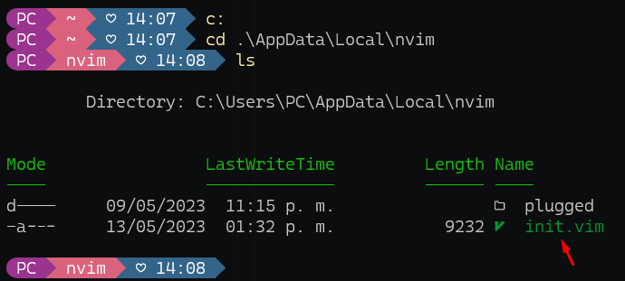
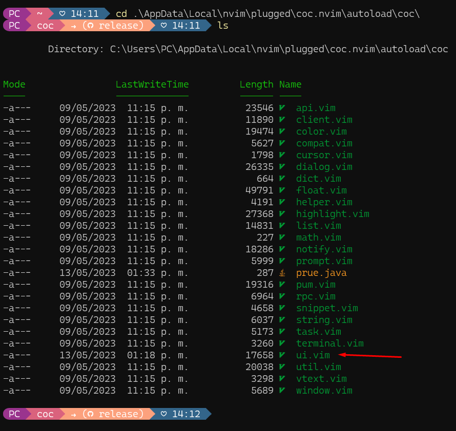
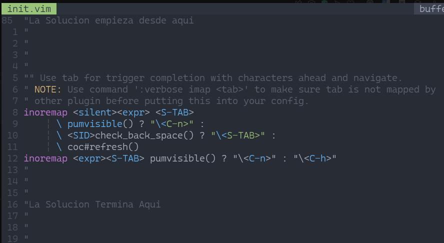
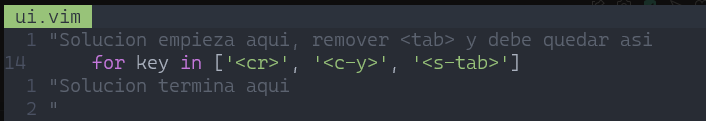

# Solucion del Error
# "E117: Función Desconocida <SNR>9x_check_back_space"
#### Debes saber que el plugin de AUTOCOMPLETADO genera este error, pero es solo un error de bindeos
#### Esta pequeño repositorio da solucion al problema del tab, debido a que inicialmente no se puede hacer uso de la tabulacion 'TAB' en el modo insercion del neovim
#### En este repositorio Encontraras 2 archivos: <code>init.vim</code> y <code>ui.vim</code>
#### Los cuales son importantes para resolver el problema
<table>
<theader>
<tr><th> GUIA </tr></th>
</theader>
<tbody>
  <tr><td>I. Ubicacion de los archivos
    <pre>
    Estas ubicaciones son las mostradas en el <a href="https://www.youtube.com/watch?v=N0Zq1xhJEes">Tutorial</a>, por lo tanto son ubicaciones por defecto.
    <li> init.vim : .\AppData\Local\nvim </li>
    
    <li> ui.vim: .\AppData\Local\nvim\plugged\coc.nvim\autoload\coc </li>
    
    </pre>
    </tr></td>
 
    
   <tr><td>II. Soluciones:  
     <pre>
     Te tengo 2 formas de solucionar este problema, las 2 hacen lo mismo, tu decides cual elegir
     <li> IMPORTANTE: solo se modifico la solucion, NADA MAS</li>
     <li> Descargando Repositorio: Descarga este repositorio y remplaza <code> init.vim </code> y <code> ui.vim </code> en las direcciones donde se encuentran </li>
     <li> Copiando solo la solución: Abre <code> init.vim  y  ui.vim  seguidamente remplaza la solucion en tu archivo init.vim y ui.vim respectivamente, init.vim  y ui.vim tienen colocados en comentarios la parte de la solucion.</li>
     <li>Para init.vim </li>
     
     <li>Para ui.vim </li>
     
     </pre>
   </tr></td>
  
   <tr><td>III. Pasos finales
    <pre>
      <li> Guardar los cambios </li>
      <li> Reiniciar el terminal </li>
      <li> LISTO </li>
      <li> Ahora ya puedes usar TAB en el modo 'insertar' para poder tabular correctamente el codigo</li>
    </pre>
  
   </tr></td>
   <tr><td>IV. Respecto al AUTOCOMPLETADO - ¿Como Navego? 
    <pre>
      <li> El plugin sigue funcionando </li>
      <li>Te seguira apareciendo la ventada con opciones de autocompletado</li>
      <li>SHIFT + TAB navegara en la tabla de arriba a abajo</li>
      <li>No es necesario presionar ENTER para autocompletar las sugerencias de la tabla, basta con SHIFT+TAB para que se autocomplete</li>
     </pre>
   </tr></td>
   
  <tr><td> 5. Gracias
    <pre>
      <li> Cualquier duda, no dudes en escribirme a mi correo : achaisa@unsa.edu.pe </li>
    </pre>
   </tr></td>
  </tbody>
  </table>

  

